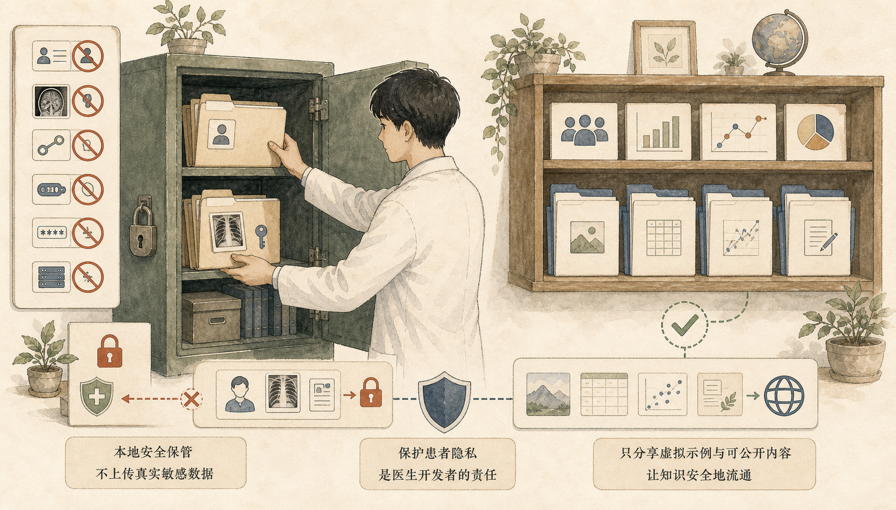

# GitHub 医护人员入门指南

给医生、护士、医学生和医疗科研人员的 GitHub 小白课程站。

这不是泛程序员 Git 命令教程，而是一套面向医疗场景的 **GitHub 阅读、判断、复用与安全发布课程**。它先教你看懂一个开源项目，再逐步带你完成收藏、下载、提 Issue、写 README、发布教学 demo。

[在线学习入口](https://2023anita.github.io/github-medical-beginner-guide/) · [中文课程首页](https://2023anita.github.io/github-medical-beginner-guide/zh/) · [30 分钟练习](https://2023anita.github.io/github-medical-beginner-guide/zh/practice/) · [资料库](https://2023anita.github.io/github-medical-beginner-guide/zh/resources/)


## Language / 语言切换

网站导航栏支持多语言切换。GitHub 仓库页也可以从这里直接进入对应版本：

| 语言 | 课程入口 | 适合用途 |
|---|---|---|
| 🇨🇳 中文 | [进入中文课程](https://2023anita.github.io/github-medical-beginner-guide/zh/) | 主教材，内容最完整 |
| 🇺🇸 English | [Open English course](https://2023anita.github.io/github-medical-beginner-guide/en/) | English overview and guided learning path |
| 🇯🇵 日本語 | [日本語版を見る](https://2023anita.github.io/github-medical-beginner-guide/ja/) | 日本語で概要と学習導線を確認 |
| 🇰🇷 한국어 | [한국어 과정 열기](https://2023anita.github.io/github-medical-beginner-guide/ko/) | 한국어 학습 안내와 장별 가이드 |
| 🇫🇷 Français | [Ouvrir la version française](https://2023anita.github.io/github-medical-beginner-guide/fr/) | Parcours guidé en français |
| 🇩🇪 Deutsch | [Deutsche Version öffnen](https://2023anita.github.io/github-medical-beginner-guide/de/) | Deutscher Überblick und Lernpfad |

## 这个项目一句话说清楚

很多医护人员不是学不会 GitHub，而是一开始就被程序员术语和命令行劝退了。

这个课程站把学习顺序改成：

```text
先看懂仓库页面 -> 判断项目是否靠谱 -> 下载和收藏 -> 用 AI 解释 README -> 安全发布自己的教学 demo
```

学习者不需要先会写代码，也不需要先背 Git 命令。第一目标是建立判断力：知道一个医疗 AI 项目、科研代码或开源工具是否值得继续看，风险在哪里，能不能安全复用。

## 适合谁

| 人群 | 可以用它解决什么问题 |
|---|---|
| 医生、护士 | 看懂医疗 AI / 科研工具仓库，不再只看标题和 Star |
| 医学生、研究生 | 下载课程 demo、复现论文代码前，先判断项目质量 |
| 医疗科研人员 | 识别 README、Release、Issues、License 和数据边界 |
| 科室带教老师 | 用网站替代一次性 PPT，做可反复访问的入门课 |
| 非程序员 AI 学习者 | 用更低门槛理解 GitHub 是什么、怎么用、哪里危险 |

## 小白怎么开始

### 第 1 层：3 分钟看懂全局

先打开 [课程首页](https://2023anita.github.io/github-medical-beginner-guide/zh/)，只回答三个问题：

- 这门课是不是给我这种非程序员准备的？
- GitHub 对医护人员到底有什么用？
- 我应该先看哪个入口？

推荐先看首页和框架图，不急着碰命令行。

### 第 2 层：15 分钟建立判断框架

进入 [框架图与流程](https://2023anita.github.io/github-medical-beginner-guide/zh/visual-map)，记住一条主线：

| 步骤 | 你要学会的判断 |
|---|---|
| 看 README | 项目说明是否清楚，输入输出是否写明 |
| 看 Release | 普通用户是否有正式版本可下载 |
| 看 Issues | 有没有安装失败、长期无人维护或医疗风险反馈 |
| 看 License | 教学、科研、商业复用是否被允许 |
| 看数据说明 | 是否涉及真实患者数据、隐私和合规问题 |
| 看免责声明 | 是否明确不用于临床诊断和治疗决策 |


### 第 3 层：30 分钟做一次练习

打开 [30 分钟课堂练习](https://2023anita.github.io/github-medical-beginner-guide/zh/practice/)，完成一次闭环：

```text
找项目 -> 看 README -> 判断风险 -> 点 Star -> 让 AI 解释 -> 写学习记录
```

练习页内置了医护人员专用提示词，例如：

- 解释一个 GitHub 项目解决什么医疗或科研问题；
- 判断一个项目是否靠谱；
- 检查论文代码是否容易复现；
- 帮你把问题整理成适合发到 GitHub 的 Issue；
- 帮你写带安全边界的医疗 AI 教学 demo README。


### 第 4 层：1 小时做出自己的安全 demo

当你能看懂别人的仓库后，再学习发布自己的小项目：

- 创建一个公开仓库；
- 写清楚 README；
- 只使用虚构数据或脱敏示例；
- 加上安全边界和免责声明；
- 用 GitHub Pages 展示教学页面；
- 用 Issues 收集反馈。

重点不是做一个复杂系统，而是把一个小工具、小教程、小科研流程放得清楚、干净、可复用。

## 网站里有什么

| 模块 | 入口 | 作用 |
|---|---|---|
| 课程首页 | [zh/](https://2023anita.github.io/github-medical-beginner-guide/zh/) | 解释学习目标和课程路线 |
| 框架图 | [visual-map](https://2023anita.github.io/github-medical-beginner-guide/zh/visual-map) | 用流程图理解 GitHub 学习、评估和发布 |
| 章节教材 | [chapters](https://2023anita.github.io/github-medical-beginner-guide/zh/chapters/00-why-github) | 保留源教材 0-16 章内容 |
| 练习页 | [practice](https://2023anita.github.io/github-medical-beginner-guide/zh/practice/) | 30 分钟课堂练习、AI 提示词、记录模板 |
| 资料库 | [resources](https://2023anita.github.io/github-medical-beginner-guide/zh/resources/) | 术语卡、8 项检查表、安全边界、模板入口 |
| 多语言入口 | 导航栏语言菜单 | 中文为主教材，英日韩法德为本地化导览 |

## 课程核心图谱


这套课程把 GitHub 拆成 5 个更容易理解的能力：

1. **看懂**：知道仓库页面每个区域在做什么。
2. **判断**：从 README、Issues、Release、License 和数据说明评估项目。
3. **复用**：下载正式版本或源码，用 AI 辅助理解。
4. **反馈**：用 Issue 礼貌、清楚地描述问题。
5. **发布**：把自己的教学 demo 安全放到 GitHub。

## 医疗场景的安全边界

GitHub 可以帮助教学、科研学习、项目记录和开源协作，但不能替代临床判断。

请始终遵守：

- 不上传真实患者数据；
- 不上传医院内部资料、账号、密钥、token、`.env` 文件；
- 不把未经验证的医疗 AI 项目直接用于诊断、治疗或急救；
- 教学 demo 优先使用虚构数据或公开示例数据；
- README 中明确写出适用范围、风险边界和免责声明。



## 为什么不用传统 PPT

PPT 适合讲概念，但 GitHub 更适合在网页里学。

这个项目把课程做成网站，是为了让学习者可以：

- 课上跟着点，课后继续看；
- 从首页进入，再按章节和练习推进；
- 随时复制提示词、模板和检查表；
- 用真实页面理解真实工具；
- 后续持续更新，而不是停留在一次性课件。

## 本地运行

```bash
npm install
npm run docs:dev
```

构建：

```bash
npm run docs:build
```

本地预览默认会输出类似：

```text
http://127.0.0.1:5173/github-medical-beginner-guide/
```

## 项目结构

```text
docs/
  zh/                 中文主课程
  en/ ja/ ko/ fr/ de/ 多语言导览
  public/assets/      封面、插图和源图
  .vitepress/         VitePress 配置
scripts/
  build-content.mjs   从源教材生成中文章节
  build-locales.mjs   生成多语言导览页面
```

## 内容来源

源教材来自本地 Obsidian 文档：

```text
/Users/anita/obsidian2026/teaching/GitHub保姆级教程：从0到1完整使用通俗指南教材.md
```

构建脚本会把源教材按章节拆成 VitePress 页面，并保留原文表格、代码块、提示词、Issue 模板和课堂练习。

## 声明

本课程仅用于教学与科研学习，不用于临床诊断、治疗决策或急救场景。任何医疗 AI 项目在真实场景中使用前，都需要经过合规、伦理、数据安全和专业验证。
