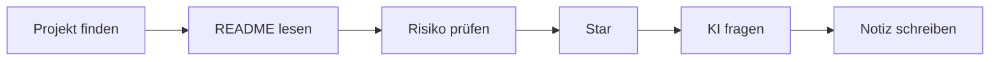

# 30-Minuten-Unterrichtsübung


Finden Sie ein Projekt, lesen Sie das README, prüfen Sie Risiken, vergeben Sie einen Star, fragen Sie KI nach einer Erklärung und schreiben Sie eine Lernnotiz.



## AI prompt template

```text
I am a medical learner and not a professional programmer.
Please explain this GitHub project in plain language:
1. What problem does it solve?
2. What files should I read first?
3. Does it involve patient data, privacy, or clinical-use risk?
4. Can I safely use it for learning or teaching?
```

## Learning note template

| Field | Notes |
|---|---|
| Project name |  |
| Why I chose it |  |
| What README says |  |
| Safety concerns |  |
| What I learned |  |
