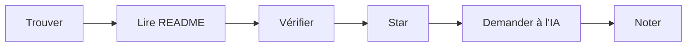

# Exercice de 30 minutes


Trouvez un projet, lisez son README, vérifiez les risques, ajoutez une Star, demandez une explication à l'IA et écrivez une note.



## AI prompt template

```text
I am a medical learner and not a professional programmer.
Please explain this GitHub project in plain language:
1. What problem does it solve?
2. What files should I read first?
3. Does it involve patient data, privacy, or clinical-use risk?
4. Can I safely use it for learning or teaching?
```

## Learning note template

| Field | Notes |
|---|---|
| Project name |  |
| Why I chose it |  |
| What README says |  |
| Safety concerns |  |
| What I learned |  |
