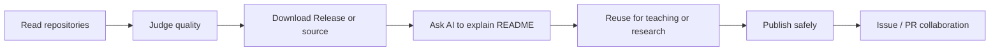
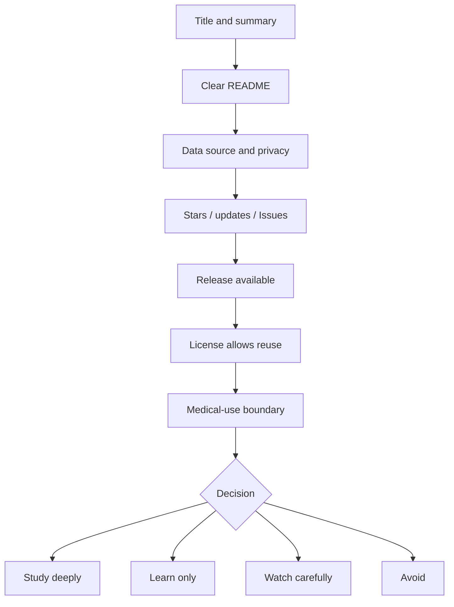
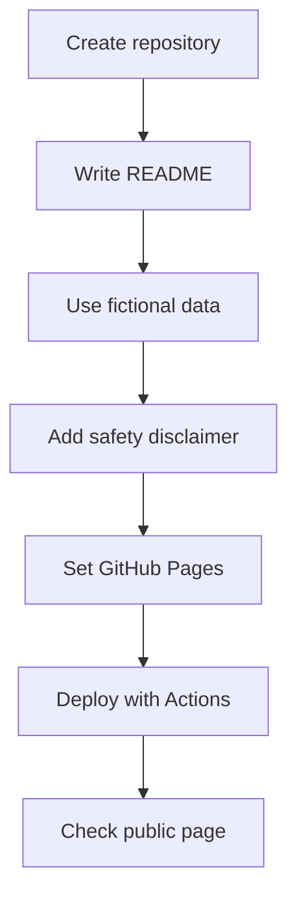
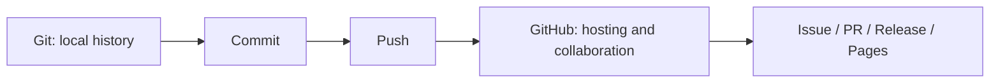

# Cartes visuelles et workflows

## Parcours d'apprentissage

```mermaid
flowchart LR
  A["Read repositories"] --> B["Judge quality"]
  B --> C["Download Release or source"]
  C --> D["Ask AI to explain README"]
  D --> E["Reuse for teaching or research"]
  E --> F["Publish safely"]
  F --> G["Issue / PR collaboration"]
```

## Évaluation d'un projet médical

```mermaid
flowchart TD
  A["Title and summary"] --> B["Clear README"]
  B --> C["Data source and privacy"]
  C --> D["Stars / updates / Issues"]
  D --> E["Release available"]
  E --> F["License allows reuse"]
  F --> G["Medical-use boundary"]
  G --> H{"Decision"}
  H --> I["Study deeply"]
  H --> J["Learn only"]
  H --> K["Watch carefully"]
  H --> L["Avoid"]
```

## Publication GitHub sûre

```mermaid
flowchart TD
  A["Create repository"] --> B["Write README"]
  B --> C["Use fictional data"]
  C --> D["Add safety disclaimer"]
  D --> E["Set GitHub Pages"]
  E --> F["Deploy with Actions"]
  F --> G["Check public page"]
```

## Relation entre Git et GitHub

```mermaid
flowchart LR
  A["Git: local history"] --> B["Commit"]
  B --> C["Push"]
  C --> D["GitHub: hosting and collaboration"]
  D --> E["Issue / PR / Release / Pages"]
```
