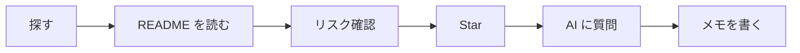

# 30 分の教室練習


プロジェクトを 1 つ探し、README を読み、リスクを確認し、Star を付け、AI に説明させ、短い学習メモを書きます。



## AI prompt template

```text
I am a medical learner and not a professional programmer.
Please explain this GitHub project in plain language:
1. What problem does it solve?
2. What files should I read first?
3. Does it involve patient data, privacy, or clinical-use risk?
4. Can I safely use it for learning or teaching?
```

## Learning note template

| Field | Notes |
|---|---|
| Project name |  |
| Why I chose it |  |
| What README says |  |
| Safety concerns |  |
| What I learned |  |
