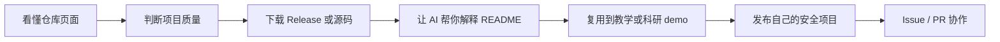
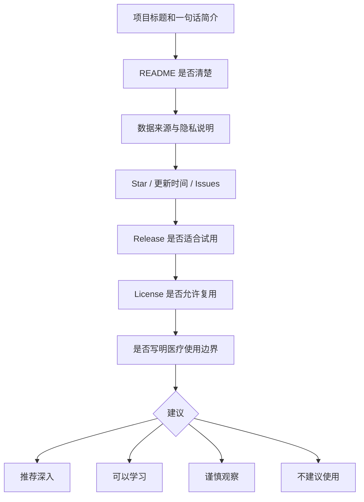
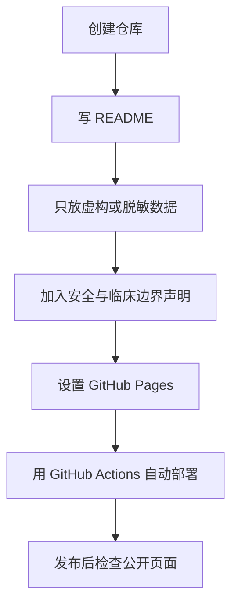
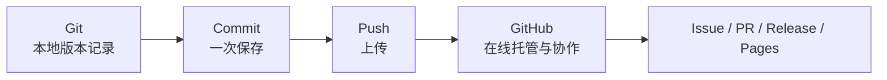

# 框架图与流程

## 学习路线图

```mermaid
flowchart LR
  A["看懂仓库页面"] --> B["判断项目质量"]
  B --> C["下载 Release 或源码"]
  C --> D["让 AI 帮你解释 README"]
  D --> E["复用到教学或科研 demo"]
  E --> F["发布自己的安全项目"]
  F --> G["Issue / PR 协作"]
```

## 医疗项目评估流程

```mermaid
flowchart TD
  A["项目标题和一句话简介"] --> B["README 是否清楚"]
  B --> C["数据来源与隐私说明"]
  C --> D["Star / 更新时间 / Issues"]
  D --> E["Release 是否适合试用"]
  E --> F["License 是否允许复用"]
  F --> G["是否写明医疗使用边界"]
  G --> H{"建议"}
  H --> I["推荐深入"]
  H --> J["可以学习"]
  H --> K["谨慎观察"]
  H --> L["不建议使用"]
```

## GitHub 发布流程

```mermaid
flowchart TD
  A["创建仓库"] --> B["写 README"]
  B --> C["只放虚构或脱敏数据"]
  C --> D["加入安全与临床边界声明"]
  D --> E["设置 GitHub Pages"]
  E --> F["用 GitHub Actions 自动部署"]
  F --> G["发布后检查公开页面"]
```

## Git 与 GitHub 的关系

```mermaid
flowchart LR
  A["Git\n本地版本记录"] --> B["Commit\n一次保存"]
  B --> C["Push\n上传"]
  C --> D["GitHub\n在线托管与协作"]
  D --> E["Issue / PR / Release / Pages"]
```
